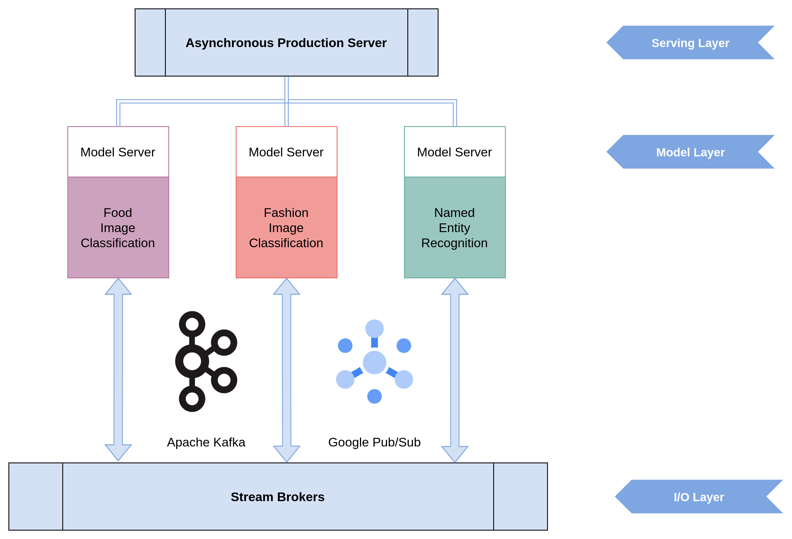

# AsyncTorchServe-Kafka-Pubsub
Asynchronous PyTorch model serving 
on top of event streaming platforms 
such as Apache Kafka or Google PubSub



## Usage Guide

1. Git clone (or download and unpack) the repository

2. Change to the project directory
```
$ cd AsyncTorchServe-Kafka-Pubsub/
```

3. Setup and activate a Python virtual environment
```
$ python3 -m venv venv
$ source venv/bin/activate
```

4. Install the requirements
```
$ python -m pip install --upgrade pip
$ python -m pip install --upgrade setuptools
$ python -m pip install --upgrade wheel

$ pip install -r requirements.txt
```

5. Add our package to Python's path
```
$ export PYTHONPATH=./
```

6. Setup the configuration in `./config.ini`
```
[options]
stream_processor = Kafka
; stream_processor = PubSub

[models] ; list of models to instantiate in the server
image_classification

[Kafka]
bootstrap_servers = localhost:9092

[PubSub]
project = ; enter google cloud project
account_keypath = ; enter path to the private key json
```

7. For Apache Kafka, start the docker container:
```
$ docker-compose up
``` 
For Google PubSub, 
[install](https://cloud.google.com/sdk/docs/install)
the Google Cloud SDK `gcloud` 
and setup a Google Cloud project 
with PubSub API enabled.

8. Create the streaming topics
```
$ python bin/topics.py --create
``` 

9. Start the server
```
$ python async_torchserve/app.py --config=config.ini
```

10. Send downloaded FashionMNIST images to the input topic interactively
```
$ python bin/push_data.py --download
```

11. Pull the streaming predictions from the output topic
```
python bin/pull_data.py
```

12. Cleanup by deleting the topics, 
especially if using Google PubSub
```
python bin/topics.py --delete
``` 